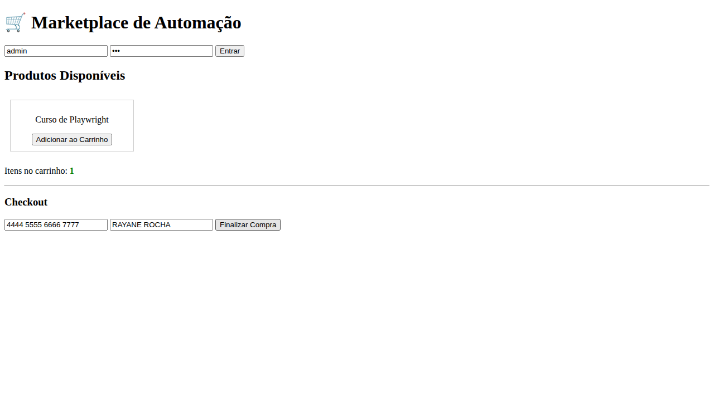

# 🛒 Marketplace Automation Project - Playwright & Python

Este projeto é uma demonstração de um fluxo completo de automação de testes **End-to-End (E2E)**. Desenvolvi tanto o Marketplace (Frontend) quanto os scripts de automação para simular uma jornada real de compra.

## 🚀 Funcionalidades Automatizadas
- [x] **Login**: Validação de acesso à área restrita.
- [x] **Carrinho**: Adição de produtos ao carrinho de compras.
- [x] **Checkout**: Preenchimento de dados de pagamento e finalização de venda.
- [x] **Evidência**: Captura de screenshot automática ao final do teste.

## 🛠️ Tecnologias Utilizadas
- **Linguagem:** Python 3.12
- **Framework de Teste:** Playwright
- **Runner:** Pytest
- **Ambiente:** GitHub Codespaces (Linux)

## 📸 Evidência de Sucesso


## 📋 Como rodar o projeto
1. Instale as dependências:
   ```bash
   pip install playwright pytest
   playwright install
   playwright install-deps